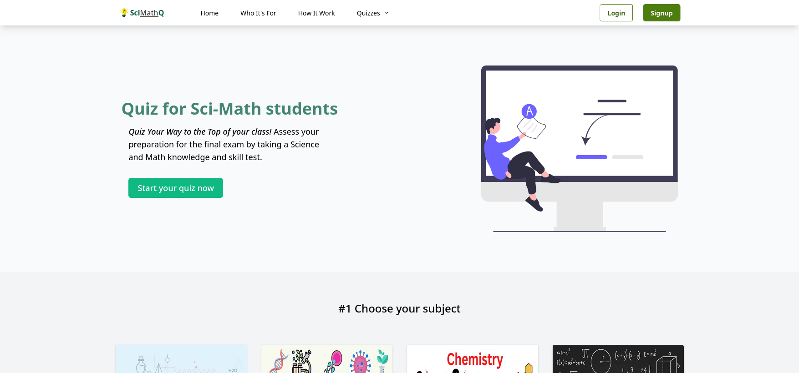

# SciMathQ

A web-based quiz application to prepare science and mathematics students for final exam.

## Preview

|          Desktop           |          Mobile           |
| :------------------------: | :-----------------------: |
|  |  |

Live [Demo](https://sci-math-quiz.vercel.app/)

## Testing

- Clone the project

```npm
git clone https://github.com/theomaro/sci-math-quiz.git
cd sci-math-quiz
```

- Install packages

```npm
npm install
```

- Starta development server

```npm
npm run dev
```
